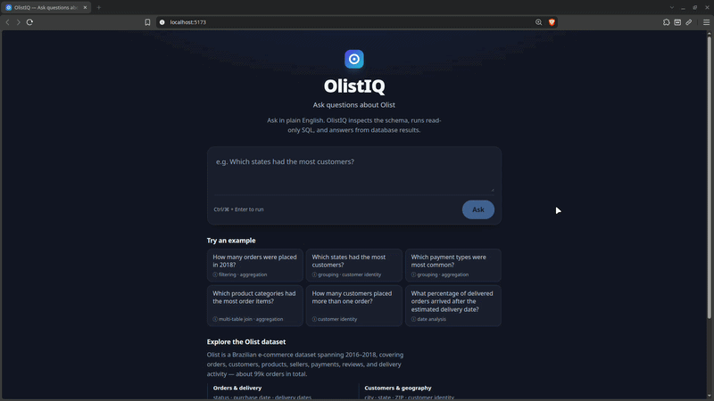

<div align="center">

  

  <h1>OlistIQ</h1>

  <p><em>Ask questions in plain English. Get answers grounded in data.</em></p>

  <p>
    <a href="https://github.com/S84v/ai-sql-analyst/actions/workflows/ci.yml">
      
    </a>
    
    
    
    
    
    
  </p>

</div>

OlistIQ turns a natural-language analytical question into a grounded answer: an LLM
agent inspects the live PostgreSQL schema, proposes SQL, and the application
validates and executes that SQL read-only before answering from the returned
rows.



## What it is

OlistIQ is a production-oriented reference implementation of an LLM analytics
agent over a real relational dataset — the
[Olist Brazilian E-Commerce Public Dataset](https://www.kaggle.com/datasets/olistbr/brazilian-ecommerce).

The interesting part is not text-to-SQL alone, but the boundaries around it:

- Generated SQL is treated as **untrusted input**.
- The database is protected by **PostgreSQL itself**, not by Python heuristics.
- The agent graph is **provider-neutral**; DeepSeek specifics live in one module.
- Every integration (HTTP/SSE, MCP) is a **thin adapter** over a framework-neutral core.

## Architecture



[View Mermaid source](docs/images/architecture.mmd)

## Production architecture

Deployment is **not** complete; this is the intended production architecture
(see [ADR-011](adr/ADR-011-gcp-neon-deployment-architecture.md)):

```text
Browser → Firebase Hosting (static React/Vite SPA)

Browser → direct HTTPS/SSE → Cloud Run (FastAPI / LangGraph) → Neon PostgreSQL
                                                             → DeepSeek API
```

Firebase Hosting serves only the static assets. The SPA calls the Cloud Run
service **directly** over HTTPS/SSE — `/query` is not proxied through Hosting — so
the frontend is built with an explicit API origin and the backend allows that
origin through CORS.

## Application request path

1. The React SPA sends a question to `POST /query` (`/query` by default, or the
   configured API origin).
2. FastAPI validates the request and streams the run over Server-Sent Events.
3. A compiled LangGraph agent drives a tool loop: it inspects the schema, writes
   SQL, reads results, and retries on errors before answering.
4. LangChain binds the two read-only tools; the tools delegate to the
   framework-neutral database core.
5. PostgreSQL executes each query in a read-only transaction.

## MCP path

```text
MCP client
    ↓
mcp_server.py
    ↓
schema.py / query.py
    ↓
PostgreSQL
```

The MCP server is an **additional edge adapter**, not a replacement for the
application path. It does not route through FastAPI or LangGraph. It exposes the
same two database capabilities as plain MCP tools and inherits the same safety
boundary.

## Core capabilities

- **Schema-aware question answering** over nine Olist tables.
- **Read-only SQL execution** with a PostgreSQL-enforced safety envelope.
- **Streaming progress** over SSE, derived from observable tool activity
  (never from raw model reasoning).
- **Markdown / GFM answers**, including tables.
- **MCP tools** (`get_schema`, `run_readonly_sql`) for local MCP clients.

## Key engineering decisions

| Decision | ADR |
| --- | --- |
| Dynamic, catalog-based schema introspection | [ADR-001](adr/ADR-001-dynamic-schema-introspection.md) |
| Read-only SQL execution boundary | [ADR-002](adr/ADR-002-read-only-sql-execution-boundary.md) |
| LangChain tool-adapter layer | [ADR-003](adr/ADR-003-langchain-tool-adapter.md) |
| LangGraph agent boundary | [ADR-004](adr/ADR-004-langgraph-agent-boundary.md) |
| DeepSeek model integration via the Responses API | [ADR-005](adr/ADR-005-deepseek-responses-model-integration.md) |
| Streaming HTTP boundary | [ADR-006](adr/ADR-006-http-streaming-boundary.md) |
| MCP tool-adapter layer | [ADR-007](adr/ADR-007-mcp-tool-adapter.md) |
| Agent evaluation strategy | [ADR-008](adr/ADR-008-agent-evaluation-strategy.md) |
| Timeout-aware termination in the agent loop | [ADR-009](adr/ADR-009-timeout-budget-termination.md) |
| Production observability boundary | [ADR-010](adr/ADR-010-production-observability-boundary.md) |
| Production deployment architecture (GCP + Neon) | [ADR-011](adr/ADR-011-gcp-neon-deployment-architecture.md) |

In short: the database core is framework-neutral; LangChain and MCP are optional
adapters at the edges; LangGraph stays provider-neutral; only `model.py` knows
DeepSeek; the HTTP boundary owns validation and transport, not SQL.

## SQL safety boundary

`backend/src/ai_sql_analyst/query.py` is the authoritative execution boundary.
Generated SQL is untrusted, and the boundary is enforced in layers:

- **Validation before execution.** A small lexical pre-check rejects empty input
  and obviously non-query statement classes. This is a fast, clear rejection,
  **not** a proof that arbitrary SQL is safe.
- **PostgreSQL enforces write protection.** Each call runs in its own
  `SET TRANSACTION READ ONLY` transaction, so writes, DDL, and write-performing
  CTEs are rejected by the server itself.
- **Single statement only.** Execution goes through a named server-side cursor
  (extended protocol), which rejects multi-statement input server-side.
- **Bounded execution.** A statement timeout is always set, and a lock timeout is
  set where it is meaningful.
- **Bounded results.** Rows are capped by an application-owned limit; the extra
  row fetched beyond the cap only sets a `truncated` flag.
- **Structured failures.** Database errors are returned as structured results
  (`ok: false` with a typed error), not raised through the boundary.

Model and MCP callers control only the SQL text. They cannot set `max_rows`,
`timeout_ms`, or the connection.

## Dataset (high level)

The [Olist Brazilian E-Commerce Public Dataset](https://www.kaggle.com/datasets/olistbr/brazilian-ecommerce)
provides roughly **99k orders** spanning approximately **2016–2018** across
orders, customers, products, sellers, payments, reviews, and geolocation.

The dataset has important relational and semantic caveats that shape correct SQL.
See [`data/README.md`](data/README.md) for provenance, acquisition, row counts,
and the caveats.

## Getting started

### Prerequisites

- Python 3.12+
- [`uv`](https://docs.astral.sh/uv/)
- Docker (for PostgreSQL)
- Node.js with npm

### 1. Configure the environment

```bash
cp .env.example .env
```

`.env` holds the PostgreSQL settings and the DeepSeek API key. The **same
`POSTGRES_*` values are used by both the Docker container and the application**.
If port `5432` is already taken locally, change `POSTGRES_PORT` and keep both
sides in sync (Docker maps that host port to the container's `5432`). Set
`DEEPSEEK_API_KEY` to a real key for the agent to run.

### 2. Start PostgreSQL

```bash
docker compose up -d postgres
```

### 3. Apply the schema

```bash
docker compose exec -T postgres sh -c 'psql -U "$POSTGRES_USER" -d "$POSTGRES_DB"' \
  < backend/sql/schema.sql
```

`backend/sql/schema.sql` creates the tables, keys, indexes, and column comments.
Apply it once before the first ingestion. It is not a migration system and is
not intended to be re-applied to an existing schema.

### 4. Load the dataset

Download the CSVs into `data/raw/` first (see [`data/README.md`](data/README.md)),
then:

```bash
cd backend
uv run python -m ai_sql_analyst.ingest
```

To truncate and reload the tables:

```bash
uv run python -m ai_sql_analyst.ingest --replace
```

### 5. Run the backend

```bash
cd backend
uv run uvicorn ai_sql_analyst.api:app
```

The API listens on `127.0.0.1:8000` by default. The agent and model are built at
startup, so `DEEPSEEK_API_KEY` must be set.

### 6. Run the frontend

```bash
cd frontend
npm ci
npm run dev
```

Open the printed URL (default `http://localhost:5173`). The Vite dev server
proxies `/query` to the backend:

```text
/query → http://127.0.0.1:8000
```

Start the backend first so the proxy has a target.

## MCP usage

Run the MCP server (stdio):

```bash
cd backend
uv run ai-sql-analyst-mcp
```

It exposes exactly two tools:

```text
get_schema
run_readonly_sql
```

The transport is **stdio**: the protocol owns stdout, so the server must never
write diagnostics there. It talks to the same PostgreSQL database and inherits
the `query.py` safety boundary; it is independent of the HTTP/SSE and LangGraph
paths.

Inspect it locally with the MCP Inspector:

```bash
npx @modelcontextprotocol/inspector \
  uv --directory ./backend run ai-sql-analyst-mcp
```

Public or hosted MCP (HTTP transport, authentication, networking) is **not**
implemented.

## Testing and verification

Backend:

```bash
cd backend
uv run pytest -q
RUN_DB_TESTS=1 uv run pytest -q
RUN_MODEL_TESTS=1 RUN_DB_TESTS=1 uv run pytest -q
```

- The default run is **database-free**: it exercises the pure core, adapters, the
  graph with fake models, the streaming translator, the API with a fake agent,
  and the MCP boundary with an in-memory client.
- `RUN_DB_TESTS=1` enables the live PostgreSQL integration tests.
- `RUN_MODEL_TESTS=1` enables the opt-in live DeepSeek smoke test (it skips
  itself when no key is configured).

Frontend:

```bash
cd frontend
npm test
npm run lint
npm run build
```

The frontend tests use **Vitest** with `jsdom` and React Testing Library;
`npm test` runs them. CI runs lint, build, and test in a separate frontend job.

### Agent evaluation (opt-in)

A **20-case golden evaluation suite** scores the real agent end to end against the
live database. On the current live deterministic baseline, **20/20 cases pass**.

- Exact analytical correctness is validated by **deterministic PostgreSQL oracle
  queries**, not by a model.
- One limited, informational LLM judge covers only subjective answer
  grounding/scope; it does not decide pass/fail.
- The intentionally expensive geolocation query is now bounded by the agent's
  deterministic timeout budget rather than exhausting the tool loop.

The suite is opt-in and not part of CI. See
[`backend/evals/README.md`](backend/evals/README.md) for the methodology and how
to run it.

## Current limitations and production hardening

This is a locally runnable reference implementation, not a deployment:

- No authentication, authorization, or rate limiting.
- Production CORS is configurable at runtime (`CORS_ALLOWED_ORIGINS`);
  development relies on the Vite proxy. The public frontend API origin is
  build-time configuration (`VITE_API_ORIGIN`), not a secret.
- No persistence, checkpointing, conversation memory, or sessions; each request
  is independent.
- No connection pooling; the database role is the image superuser and
  least-privilege hardening is not implemented.
- MCP is local/stdio only; public hosting and authentication are not implemented.
- The final answer is delivered after the model's final turn completes, not
  token-by-token.
- `get_schema()` surfaces an unavailable database as a failure rather than a
  structured result.

See the ADRs for the reasoning and the deliberately deferred hardening.

## Repository layout

```text
ai-sql-analyst/
├── adr/                  Architecture Decision Records (ADR-001 … ADR-011)
├── backend/              FastAPI + LangGraph + framework-neutral DB core + MCP
│   ├── sql/schema.sql    Physical schema and column comments
│   ├── src/ai_sql_analyst/
│   └── tests/
├── data/                 Dataset provenance, acquisition, and semantics
├── frontend/             React + TypeScript + Vite SPA ("OlistIQ")
├── docker-compose.yml    Local PostgreSQL 16
└── .env.example          Configuration template
```

## Further reading

- [`backend/README.md`](backend/README.md) — backend modules, setup, and tests.
- [`frontend/README.md`](frontend/README.md) — SPA, dev proxy, and transport.
- [`data/README.md`](data/README.md) — dataset provenance and SQL caveats.
- [`adr/README.md`](adr/README.md) — architecture decision records.
