# Data

## Purpose

OlistIQ uses the official **Brazilian E-Commerce Public Dataset by Olist** as its
real-world relational dataset for natural-language analytical queries.

## Source and attribution

- Dataset: *Brazilian E-Commerce Public Dataset by Olist*
- Provided by Olist, published on Kaggle:
  <https://www.kaggle.com/datasets/olistbr/brazilian-ecommerce>
- Licensed under
  [CC BY-NC-SA 4.0](https://creativecommons.org/licenses/by-nc-sa/4.0/).
- This repository does **not** redistribute the raw dataset. Download it
  yourself using the steps below.

## Expected files

The dataset consists of 9 CSV files. After extraction, `data/raw/` should
contain exactly these files:

- `olist_customers_dataset.csv`
- `olist_geolocation_dataset.csv`
- `olist_order_items_dataset.csv`
- `olist_order_payments_dataset.csv`
- `olist_order_reviews_dataset.csv`
- `olist_orders_dataset.csv`
- `olist_products_dataset.csv`
- `olist_sellers_dataset.csv`
- `product_category_name_translation.csv`

## Local layout

Place the downloaded CSV files directly under `data/raw/`:

```text
data/
└── raw/
    ├── olist_customers_dataset.csv
    ├── olist_geolocation_dataset.csv
    ├── olist_order_items_dataset.csv
    ├── olist_order_payments_dataset.csv
    ├── olist_order_reviews_dataset.csv
    ├── olist_orders_dataset.csv
    ├── olist_products_dataset.csv
    ├── olist_sellers_dataset.csv
    └── product_category_name_translation.csv
```

The contents of `data/raw/` are gitignored (only `.gitkeep` is tracked), so raw
dataset files are never committed to this repository.

## Acquisition

No Kaggle CLI or API credentials are required.

1. Open the official Kaggle dataset page:
   <https://www.kaggle.com/datasets/olistbr/brazilian-ecommerce>
2. Download the dataset.
3. Extract the CSV files from the downloaded archive.
4. Place the CSV files directly under `data/raw/`.

Then load them into PostgreSQL; see the
[root README](../README.md#getting-started) for the ingestion commands.

## Coverage and size

- Approximately 99,441 orders (~99k).
- Coverage spans approximately 2016–2018.

Verified row counts after ingestion:

| Table | Rows |
| --- | ---: |
| `customers` | 99,441 |
| `geolocation` | 1,000,163 |
| `order_items` | 112,650 |
| `order_payments` | 103,886 |
| `order_reviews` | 99,224 |
| `orders` | 99,441 |
| `products` | 32,951 |
| `sellers` | 3,095 |
| `product_category_translation` | 71 |

## Data model

The diagram reflects the current physical PostgreSQL schema, including the
actual composite primary keys and foreign-key relationships.



[View Mermaid source](../docs/images/erdiagram.mmd)

## Important SQL semantics

These caveats are necessary for correct analysis. The physical schema and
per-column comments live in
[`backend/sql/schema.sql`](../backend/sql/schema.sql); read them there rather
than duplicating DDL here.

- **Customer identity.** `customer_unique_id` is the person-level identity key.
  `customer_id` is minted per order and is **not** the persistent customer
  identity — grouping by it treats every order as a new customer.
- **Reviews.** `review_id` alone is not unique; the review table is keyed by
  `(review_id, order_id)`.
- **Multiple items.** An order can contain multiple items, so joining `orders` to
  `order_items` duplicates order-level values. Use `COUNT(DISTINCT order_id)` for
  order counts.
- **Multiple payments.** An order can have multiple payment records, so joining
  `order_payments` and `order_items` on `order_id` produces a fan-out that
  inflates monetary aggregates.
- **Geolocation fan-out.** A single ZIP prefix can map to many geolocation rows;
  aggregate by ZIP prefix before joining to customers or sellers.
- **Naive timestamps.** All timestamps are naive (no timezone); the source
  timezone is unknown. Do not invent timezone semantics.
- **Category translation.** The translation table covers 71 of 73 product
  categories, so joins from `products` must tolerate missing rows.
- **Installments.** `payment_installments = 0` is valid.
- **Payment types.** `not_defined` is a valid `payment_type`.
- **Revenue wording.** `SUM(payment_value)` is a sum of recorded payment amounts,
  not automatically "revenue". Define the metric explicitly before presenting it
  as one.
